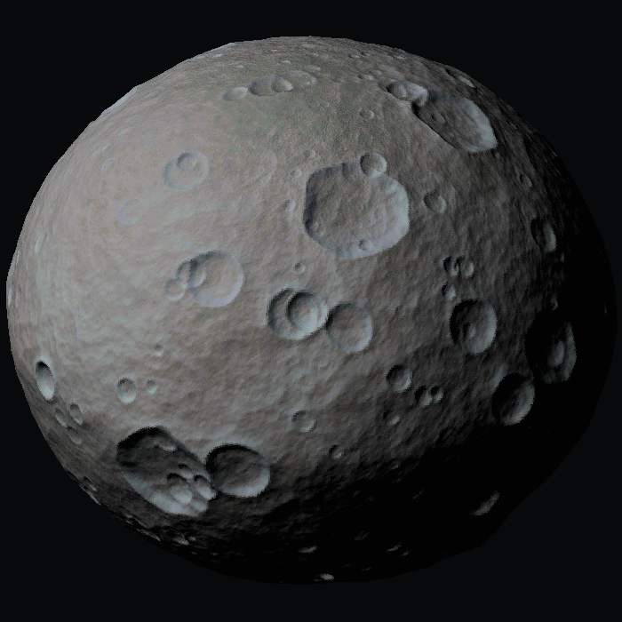
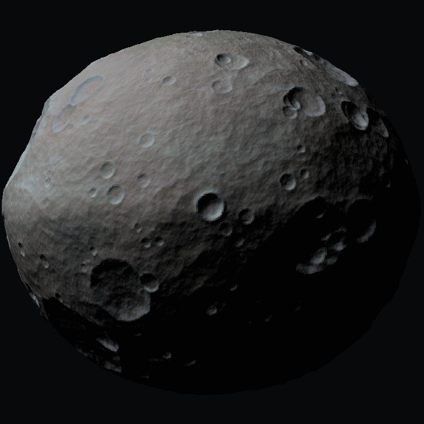
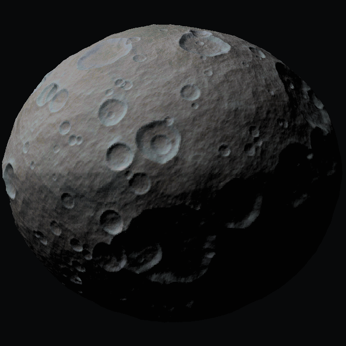
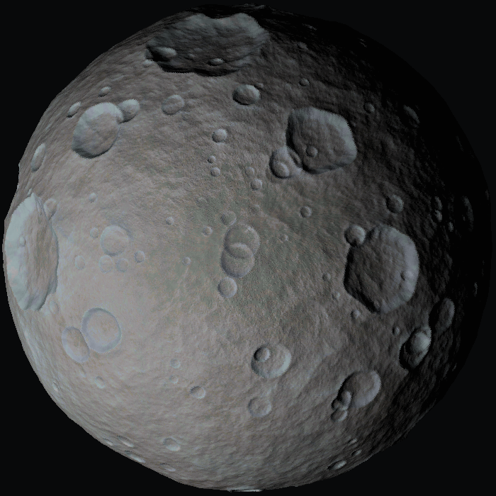

# Bennu for Kerbal Space Program

**101955 Bennu as a real celestial body — not a stock asteroid.**

[](https://www.kerbalspaceprogram.com/)
[](https://github.com/Kopernicus/Kopernicus)
[](https://github.com/CritZitGaming/KSP-Bennu/releases)
[](LICENSE)

<p align="center">
  
</p>

Stock "asteroids" in KSP are `Vessel`s. They are physics objects: they drift, they get
shoved by anything that touches them, they despawn, and they cannot carry terrain,
biomes or science situations. Bennu is a proper Kopernicus `CelestialBody`. It sits on
rails, it has a PQS terrain system with colliders, thirteen named biomes, its own science
text, a real orbit that crosses Kerbin's, and it renders through Parallax, PlanetShine and
KerbalFX like any planet.

<p align="center">
  
  
  
</p>

---

## Install

### CKAN (recommended)

Search for **Bennu** and install. CKAN will pull in Kopernicus and Module Manager for you.

### Manual

1. Install [Kopernicus](https://github.com/Kopernicus/Kopernicus/releases) and
   [Module Manager](https://github.com/sarbian/ModuleManager/releases) if you don't have them.
2. Download the latest release zip from [Releases](https://github.com/CritZitGaming/KSP-Bennu/releases).
3. Copy `GameData/Bennu/` into your KSP `GameData/` folder.

That's it. Every compatibility patch is gated behind `:NEEDS[…]`, so anything you don't
have installed is skipped silently — you can install this alongside any subset of the
supported mods and nothing will complain.

### Requirements

| | |
|---|---|
| **KSP** | 1.12.x |
| **Required** | Kopernicus, Module Manager |
| **Enhanced by** | Parallax Continued, PlanetShine, KerbalFX, SCANsat, Community Resource Pack |

Developed and verified against KSP 1.12.4, Kopernicus 1.12.1-244, Parallax Continued,
EVE Redux 3.1.2, PlanetShine, KerbalFX, Deferred 1.3.5, SCANsat 21.1 and CRP.

---

## What you're flying to

| | Real Bennu | This build |
|---|---|---|
| Mean radius | 244.9 m | **979.6 m** (4×) |
| Datum radius | — | 949 m |
| Terrain relief | — | 0 – 219 m above datum |
| Surface gravity | 8.1 × 10⁻⁵ m/s² | **0.049 m/s²** (0.005 g, Gilly-class) |
| Escape velocity | 0.20 m/s | **9.65 m/s** |
| Sphere of influence | ~1.7 km | **65.4 km** (69 × radius) |
| Rotation period | 4.296 h | **4.296 h** (exact) |
| Geometric albedo | 0.044 | **0.044** (exact) |
| Semi-major axis | 1.126391 AU | **1.126391 ×** Kerbin's SMA |
| Eccentricity | 0.2037 | **0.2037** (exact) |
| Inclination | 6.035° | **6.035°** (exact) |

Everything is held to the real body except two deliberate departures, both explained
under [Design decisions](#design-decisions).

### The orbit

Bennu crosses Kerbin's orbit, exactly as the real Bennu crosses Earth's:

```
periapsis   12,197,619,928 m   (inside Kerbin's 13,599,840,256 m)
apoapsis    18,439,855,404 m   (outside)
period      11,002,437 s       (1.195 Kerbin years)
```

Transfer windows are real and infrequent, and the 6° inclination has to be dealt with.
This is an intentionally awkward target to reach — that is the point of it.

### The surface

Gravity here is a suggestion rather than a rule. You land at under 1 m/s, and a Kerbal
jumping is thrown about 90 m up with a two-minute hang time. Escape velocity is 9.65 m/s,
so an over-enthusiastic RCS burst will put your lander in orbit.

The body reflects 4.4% of the light that reaches it — darker than charcoal. The unlit side
is essentially black, and solar panel output and thermals are driven by that real albedo.

### Biomes

Thirteen, using real IAU nomenclature — Bennu's features are named for birds and
bird-like creatures from world mythology — plus the four OSIRIS-REx candidate sample sites:

> Equatorial Ridge · Northern Hemisphere · Southern Hemisphere · North Polar Region ·
> South Polar Region · Nightingale Crater · Osprey Crater · Kingfisher Crater ·
> Sandpiper Crater · Benben Saxum · Roc Saxum · Gargoyle Saxum · Tlanuwa Regio

Each has its own science text and its own resource abundances.

---

## Resources

**Bennu is a water mine, not a metal mine.** That isn't a gameplay invention — it's why
the real body was chosen as a mission target. It's a B-type carbonaceous asteroid, and the
returned sample was dominated by hydrated clay minerals, with magnetite, iron sulfides,
carbonates, phosphates and ~8.5% carbon by weight. What it never was is a *differentiated*
body: nothing melted and sorted itself into an ore deposit, so the metals that concentrate
through geological processing are largely absent.

Stock `Ore` plus eleven CRP resources are configured, with per-biome overrides:

| | Abundance | |
|---|---|---|
| Hydrates | 8–32 | hydrated phyllosilicates, the dominant mineral |
| Substrate / Dirt | 8–30 | the whole body is loose regolith |
| Water | 6–28 | the reason anyone comes here |
| Minerals | 5–22 | carbonates, phosphates |
| Ore | 4–18 | |
| MetallicOre | 3–14 | magnetite, iron sulfides |
| Silicates, Gypsum | 2–10 | carbonaceous, not stony; sulfates from aqueous alteration |
| RareMetals | 0.5–4 | chondritic PGM content |
| ExoticMinerals | 0.3–2.5 | |
| Uraninite | 0.1–1.2 | nearly absent — never differentiated |

The biome overrides reward actually scanning before you land:

- **Nightingale Crater** — Water 15–45, Hydrates 18–50. The real TAG site, where
  OSIRIS-REx sank in far deeper than planned and hit the freshest material on the body.
- **Osprey / Kingfisher / Sandpiper** — elevated Water; freshly excavated subsurface.
- **Polar regions** — Water 12–38. Genuine cold traps; they hold what the equator loses.
- **Equatorial Ridge** — Substrate/Dirt up to 40. Centrifugal migration piles mobile fines
  here; it's what built the ridge in the first place.
- **Tlanuwa Regio and the saxa** — MetallicOre and RareMetals up, Substrate down to 1–5.
  Bare rock, nothing loose to scoop.

---

## Mod compatibility

All patches live in `GameData/Bennu/Compatibility/` and are gated behind `:NEEDS[…]`.

### Parallax Continued

Full terrain shader, scaled-space shader, and a four-tier boulder scatter system
(gravel → cobbles → boulders → saxa) with colliders on the larger tiers. Densities are set
far above Gilly's on purpose: *"there is nowhere flat to put a lander"* is the single most
characteristic fact about Bennu's real surface.

Detail textures and rock models are **referenced** from Parallax's own stock texture packs
(Gilly's set — dark, airless, angular rock, the closest match already installed). Nothing
is copied or redistributed; the paths just have to resolve. Bennu's much darker
carbonaceous colour comes from its own vertex colour map, which Parallax blends over those
details.

### PlanetShine

Intensity is derived from real albedo rather than eyeballed: Mun is 0.12 albedo at
intensity 1.0, so Bennu at 0.044 gets **0.37**. A craft on the night side receives almost
no fill light, which is correct.

### KerbalFX

RoverDust and ImpactPuffs are both configured, with an explicit near-black dust tint that
overrides the biome map — Bennu's biome colours are distinct markers for Kopernicus, not
surface colours, so left alone KerbalFX would throw up bright orange dust in Benben Saxum.

Impact puffs are turned up 1.4×, because OSIRIS-REx sank half a metre into this surface
during sample collection and threw up a debris cloud far larger than anyone predicted.

### SCANsat

Altimetry range is rescaled to 0–240 m using Moho's `mercury` palette. On SCANsat's
defaults every pixel of Bennu's 0–219 m relief lands in the bottom 2.5% of the palette and
the map renders as one flat colour — complete, and useless. Per-resource display cutoffs
are set for all twelve resources to match the abundances above.

---

## Design decisions

Two things deliberately depart from the real body.

**Scale (4×).** At true size a Kerbal walking exceeds escape velocity, landing legs never
settle, and the SOI is barely seven body-radii wide. 4× with Gilly-class gravity keeps it
recognisably a small asteroid while making it somewhere you can actually operate. Raising
gravity to 0.005 g at this size implies an unphysical density; that is the trade being
made, and it only affects the mass, not anything you see.

If you want the true, brutal version, set `geeASL = 0.0000083` in `Configs/Bennu.cfg`.

**Rotation direction.** Real Bennu is a retrograde rotator (obliquity 177.6°). KSP has no
axial tilt for celestial bodies, so there is no correct way to express that, and this spins
prograde with the correct period. A negative `rotationPeriod` is the usual suggestion for
reversing spin; it's untested here and touches enough of KSP's rotation handling that it
ships positive, with the alternative sitting commented out one line below in `Bennu.cfg`.

---

## How the body was made

There is no hand-painted art in this pack. The shape model and all four maps are generated
procedurally and deterministically by the tools in `Tools/`, which need nothing but Windows
PowerShell 5.1 and .NET Framework.

A spinning-top base shape, plus fBm lumpiness, ridged mid-scale facets, fine roughness, and
a 260-crater population sampled from a bounded power law with bowl, rim-crest and ejecta
profiles. All noise is sampled in 3D on the sphere, so there are no antimeridian seams and
no polar pinching.

```bash
powershell -File Tools/Generate-BennuMaps.ps1
```

The map-view node icon is generated too — a flat-poled diamond drawn to the same shape law
as the body, so reshaping the body reshapes the icon:

```bash
powershell -File Tools/Generate-BennuIcon.ps1
```

Every seed is fixed, so a re-run reproduces identical bytes. There is also a validator that
checks the whole pack — brace balance, live reflection of every config key against your
installed `Kopernicus.dll`, texture path resolution, byte-exact biome colour matching in
both directions, derived physics, and the terrain slope distribution measured off the
shipped height map:

```bash
powershell -File Tools/Validate-Bennu.ps1
```

**Full detail on the generation pipeline, the validator, and what flight testing changed is
in [docs/TECHNICAL.md](docs/TECHNICAL.md).**

---

## Known limits

- **Flight-tested twice**, with fixes applied afterward but not yet re-flown. Scatter
  density is the value most likely to still want tuning — it was cut hard and deliberately
  errs sparse. `spawnChance` in `Bennu_Parallax_Scatters.cfg` is the single knob.
- **The 1.1.0 scaled-space lighting change is reasoned, not yet observed.** Dropping
  `_Hapke` from 0.85 to 0.6 in `Bennu_Parallax.cfg` should stop the body flattening out as
  you zoom away from it, but it is a visual judgement that needs eyes on it in map view.
  If it still reads too flat, drop the scaled and terrain values together toward Gilly's
  0.30.
- **Prograde rotation**, for the reason above.
- **No custom rock models.** Boulders reuse Gilly's meshes. They're good meshes and Bennu's
  real boulders are angular dark rubble, so it reads well, but they aren't Bennu-specific.
- **`contractWeight` is left at default**, so contracts may target Bennu about as often as
  any other body despite being much harder to reach. Lower it in `Bennu.cfg` if that
  bothers you.
- **Resource abundances aren't balanced against any particular economy.** They're set from
  real composition and against stock Ore's 1–15 baseline, not tuned against Kerbalism,
  MiningExpansion or WildBlue converter chains.
- **If you retune `Bennu_Resources.cfg`, retune the SCANsat cutoffs to match.** The
  validator will tell you the two files disagree, but it can't know what you intended.

## Troubleshooting

**Bennu looks wrong in map view or the tracking station after I changed something.**
Delete `GameData/Bennu/Cache/Bennu.bin` and let Kopernicus rebuild it. (With Parallax
Continued installed that folder stays empty, which is expected — Parallax displaces a dense
uniform sphere from the height map instead of using a PQS-baked mesh.)

**A white, untextured body appears in my main menu.**
That is almost certainly not Bennu. Kopernicus picks the main menu body at random from
those flagged `randomMainMenuBody`, and a planet pack with missing textures will render
white while its atmosphere rim still draws. `Optional/EternalMainMenuFix.cfg` is a
workaround for one specific pack that does this (Eternal) — copy it into `GameData` and
those bodies stop being eligible for the main menu. It is kept outside `GameData/Bennu/`
deliberately, because this pack shouldn't silently patch someone else's mod. The real fix
is repairing that pack's install.

**The night side and shadowed crater floors look like grey haze instead of near-black.**
Something in your install is lifting ambient light. Bennu reflects 4.4% of incident light,
so ambient lift shows on it far more than on anything else. If you run Deferred, its global
`ambientBrightness` defaults to 0.9 — drop it to 0.5–0.7 via Ctrl+Alt+D.

---

## Credits and licence

Made by **CritZitGaming**.

Shape, colour, normal and biome maps are original procedural work. Boulder meshes and
terrain detail textures are referenced from Parallax Continued's stock texture packs at
runtime and are not redistributed here. Real Bennu data — shape, rotation, albedo, orbit,
surface nomenclature and composition — comes from NASA's OSIRIS-REx mission and the IAU
Gazetteer of Planetary Nomenclature.

Licensed under [CC BY-NC-SA 4.0](LICENSE). You may share and adapt this pack for
non-commercial purposes with credit, and derivatives must carry the same licence.
